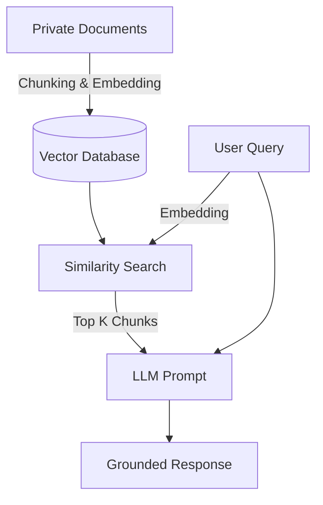

# Day 8: RAG Overview

## 1. Detailed Theory

**[RAG (Retrieval-Augmented Generation)](https://github.com/resources/articles/software-development-with-retrieval-augmentation-generation-rag)** is a hybrid technique in generative AI in which large language models (LLMs) are enhanced by connecting them to external data sources. Instead of relying solely on the internal training data of the AI model, RAG systems retrieve relevant information from a knowledge base and use it to generate more accurate, context-aware responses.

### The Problem
LLMs are trained on past data. They don't know your private company documents, and their training cutoff means they don't know recent events.

### The Solution: RAG Flow
Instead of asking the LLM to pull knowledge from its weights, we provide the knowledge in the prompt.

```text
Document -> Chunking -> Embedding -> Vector DB -> Retrieval -> LLM Generation
```

1. **Ingestion Phase:**
   - Parse PDFs, docs, or web pages.
   - **Chunk** them into smaller pieces.
   - Run those pieces through an **Embedding Model** to get vectors.
   - Store vectors + text in a **Vector Database**.
2. **Retrieval Phase:**
   - User asks: "What is our company's refund policy?"
   - Embed the question.
   - Search the Vector DB for the nearest chunks.
   - Pass the retrieved chunks + the user's question to the LLM.
   - "Based on the following context, answer the question..."

### Architecture Flow


### Best Practices & Common Mistakes
- **Chunking:** Don't chunk arbitrarily by character count. Use semantic chunking or split by headers to ensure chunks retain full context.
- **Hybrid Search:** Combine Vector Search (Dense) with Keyword Search (BM25) and use a Re-ranker to get the best of both worlds.
- **Common Mistake:** Blindly feeding chunks. If the retrieved chunks contain conflicting information, the LLM might hallucinate. Ensure your data pipeline cleans and versions documents.

## 2. Recommended YouTube Tutorials

- [What is Retrieval-Augmented Generation (RAG)? (IBM Technology)](https://www.youtube.com/watch?v=T-D1OfcDW1M)
- [Building RAG from Scratch (Andrej Karpathy conceptual style tutorial)](https://www.youtube.com/watch?v=wd7TZ4e1mTA)
- [RAG Architecture Explained (ByteByteGo)](https://www.youtube.com/watch?v=LpNgSJA1yT4)

## 3. Real-Time Project GitHub Links

- [LlamaIndex](https://github.com/run-llama/llama_index) - The standard data framework for LLM applications.
- [PrivateGPT](https://github.com/zylon-ai/private-gpt) - A popular project showing how to run RAG entirely locally without leaking data.
